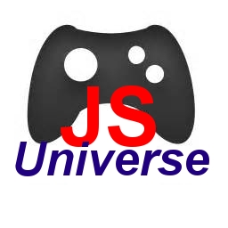

jsUniverse is generic game engine made to be flexible and extensible.
The base model is really simple and is extensible by adding new Objects and new Effects in a straightforward way.

# Model

Everything is either an `Object` or an `Effect`.

Any `Object` is an instance of a Class whose super-classes contain all the functionalities it needs.

For example a Dog class should inherit from:

- `Space`, since it has a position in space.
- `Body`, since it is a form in space, e.g. (a Circle or a Polygon).
- `Collide`, since it can collide with any other collidable object.
- `AI`, since you probably want it to move. And AI is a child class of Time, so it will be updated on every cycle of clock.

The reason it is named jsUniverse is because every object and every effect share a single global variable, namely: Universe.

When a new `Effect` is declared, e.g. `Space`, it will register itself on the `Universe`, e.g. estabilishing the universe height and width.

When a new `Object` is instantiated, it will not exist until it is added to the Universe objects lits.
There this new Object will be subject to all effects that were registered on it.

To register an effect all you need to do is `require()` it.

# Features

- Custom Body definition, meaning you can define a format for you object in terms of Polygon vertexes or a Circle radius.
- Colision calculation (not 100% working, but the hard part is done).
- Built-in classes for describing characters and objects behaviors in the universe.

# TODO

- Fix some colision problems
- Make a toy-game to test the engine.
